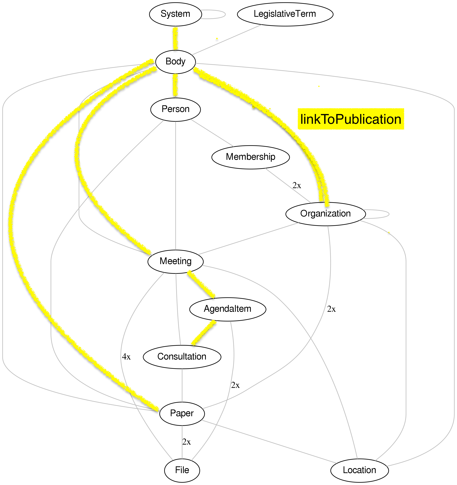

# oparl-to-eli-service

Microservice that exposes an Oparl API as a Linked Open Data API and allows to integrate the dataset in a triple store.

First, it exposes an [OParl endpoint](https://oparl.org/spezifikation/online-ansicht/) as an Linked Open Data API supporting following routes:

* `/oparl`: enriches the OParl response with JSON-LD context and lblod:linkToPublication links
* `/eli`: converts the JSON-LD OParl response to ELI(-DL) in text/turtle format

Second, the service reacts to Oparl harvesting Tasks in the triple store. Following steps are done in each task:

* Retrieve Oparl URL provided in the input container of the task
* Call function to fetch Oparl URL (JSON format), enrich towards JSON-LD, and transform to ELI-DL format
* Save ELI-DL in Turtle format in file (result container) for the add-uid task.
* Extract linkToPublication links and append the links to the input container of the (same) task. An in-memory queue is used to process all discovered OParl links during one task. 

# Usage

## Examples

### 1. Retrieve JSON-LD (enriched OParl response)

```
   curl http://localhost/oparl/oparl/System
```

This will send a request to the `OPARL_ENDPOINT` environment variable (e.g. `https://ris.freiburg.de/oparl/System`) and enrich with JSON-LD context.
Also, some of the navigation links will be added as lblod:linkToPublications.

### 2. Retrieve ELI-DL (converted OParl response)

```
   curl http://localhost/eli/oparl/body/FR/paper
```

This will use the JSON-LD response from `http://localhost:8888/eli/oparl/body/FR/paper` and convert it to ELI-DL according to the SPARQL Construct mappings described in `constants.ts`.

### 3. Start harvesting Oparl endpoint

Send an HTTP POST request to `/test` to create a harvesting task on the configured `OPARL_ENDPOINT`. This triggers the delta notifier which then starts the pipeline in `lib/pipeline.ts`.

## Docker-compose
Add the following snippet in your docker-compose.yml:

  oparl-to-eli:
    image: lblod/oparl-to-eli-service

## Environment variables

* `OPARL_ENDPOINT`: (OPTIONAL) OParl endpoint to expose with proxy API, for example: https://ris.freiburg.de/oparl
* `EMBED_JSONLD_CONTEXT`: whether the JSON-LD context should be provided inside the response or just linked. Default 'true'

## Health check

The service exposes an endpoint `/status` that you can GET to. 

## Pro-tips

* Installing Comunica (@comunica/query-sparql) with mu-javascript-template (v1.9.1) gave a type error with LRU cache. To fix this, we added "lru-cache": "^11.0.0" in our package.json.

## linkToPublications

Following navigation links in Oparl are mapped to `lblod:linkToPublication`:

]

Also, subject pages are annotated with `lblod:linkToPublication`. These pages are written to result containers to run the diff-service later on.

## Example harvesting task

The task model described in the [job-controller-service](https://github.com/lblod/job-controller-service/blob/master/README.md) is used. For example:

```
<http://lblod.data.gift/id/task/e1ac2980-aa99-11f0-9253-d7fdf867c511> a <http://redpencil.data.gift/vocabularies/tasks/Task>;
    mu:uuid """e1ac2980-aa99-11f0-9253-d7fdf867c511""";
    dct:isPartOf <http://lblod.data.gift/id/job/e1ac5090-aa99-11f0-9253-d7fdf867c511>;
    dct:created "2025-10-16T14:10:34.137Z"^^xsd:dateTime;
    dct:modified "2025-10-16T14:10:34.137Z"^^xsd:dateTime;
    adms:status <http://redpencil.data.gift/id/concept/JobStatus/scheduled>;
    task:index """1""";
    task:operation <http://lblod.data.gift/id/jobs/concept/TaskOperation/harvesting/oparl>.

<http://lblod.data.gift/id/dataContainers/e1ac5091-aa99-11f0-9253-d7fdf867c511> a nfo:DataContainer ;
    task:hasHarvestingCollection <http://lblod.data.gift/id/harvest-collections/e1ac5092-aa99-11f0-9253-d7fdf867c511> ;
    mu:uuid """e1ac5091-aa99-11f0-9253-d7fdf867c511""" .

<http://lblod.data.gift/id/harvest-collections/e1ac5092-aa99-11f0-9253-d7fdf867c511> a harvesting:HarvestingCollection ;
    mu:uuid """e1ac5092-aa99-11f0-9253-d7fdf867c511""" ;
    dct:hasPart <http://lblod.data.gift/id/remote-data-objects/e1ac5093-aa99-11f0-9253-d7fdf867c511> .


<http://lblod.data.gift/id/remote-data-objects/e1ac5093-aa99-11f0-9253-d7fdf867c511> a nfo:RemoteDataObject ;
    mu:uuid """e1ac5093-aa99-11f0-9253-d7fdf867c511""" ;
    dct:created "2025-10-16T15:12:34.137Z"^^xsd:dateTime;
    dct:creator <http://lblod.data.gift/services/oparl-to-eli-service>;
    dct:modified "2025-10-16T15:12:34.137Z"^^xsd:dateTime;
    adms:status <http://lblod.data.gift/file-download-statuses/ready-to-be-cached>.
    nie:url """https://ris.freiburg.de/oparl""" .
```

## Test ELI mapping

To test ELI mappings with SPARQL constructs, you can use the [Comunica UI](https://query.comunica.dev/#datasources=http%3A%2F%2Flocalhost%3A8888%2Foparl%2Foparl%2Fbody%2FFR%2Fpaper&query=PREFIX%20example%3A%20%3Chttp%3A%2F%2Fwww.example.org%2Frdf%23%3E%0Aconstruct%20%7B%0A%20%20%3Fs%20a%20example%3AThing%20.%0A%7D%0Awhere%20%7B%0A%20%20%3Fs%20a%20%3Chttps%3A%2F%2Fschema.oparl.org%2FPaper%3E%20.%0A%7D).
The OPARL endpoint in JSON-LD is used as data source to test the ELI mapping.

## Export data

Example SPARQL query:
```
prefix eli: <http://data.europa.eu/eli/ontology#>
prefix dct: <http://purl.org/dc/terms/>

select ?work ?title ?url
where {
?work a eli:Work ;
dct:title ?title ;
eli:is_realized_by/eli:is_embodied_by ?manifestation .

?manifestation eli:is_exemplified_by ?url .
}
LIMIT 1000
```

```
curl 'http://localhost:8891/sparql/?default-graph-uri=&query=prefix+eli%3A+%3Chttp%3A%2F%2Fdata.europa.eu%2Feli%2Fontology%23%3E%0D%0Aprefix+dct%3A+%3Chttp%3A%2F%2Fpurl.org%2Fdc%2Fterms%2F%3E%0D%0A%0D%0Aselect+%3Fwork+%3Ftitle+%3Furl%0D%0Awhere+%7B%0D%0A%3Fwork+a+eli%3AWork+%3B%0D%0Adct%3Atitle+%3Ftitle+%3B%0D%0Aeli%3Ais_realized_by%2Feli%3Ais_embodied_by+%3Fmanifestation+.%0D%0A%0D%0A%3Fmanifestation+eli%3Ais_exemplified_by+%3Furl+.%0D%0A%7D%0D%0ALIMIT+1000&format=text%2Fhtml&should-sponge=&timeout=0&signal_void=on' \
  -H 'Accept: text/html,application/xhtml+xml,application/xml;q=0.9,image/avif,image/webp,image/apng,*/*;q=0.8,application/signed-exchange;v=b3;q=0.7' \
```